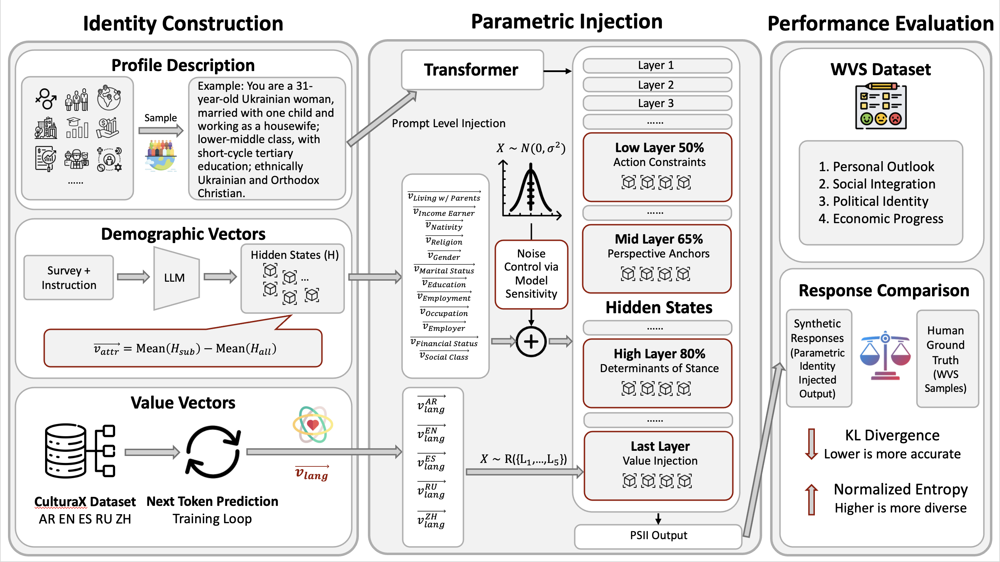

# Parametric Social Identity Injection for Enhancing Diversity in LLM-based Public Opinion Simulation

## Overview

This repository provides the official implementation of **Parametric Social Identity Injection (PSII)**, a framework for enhancing **diversity and faithfulness** in large language model (LLM)–based public opinion simulation.

PSII injects **demographic** and **value-oriented vectors** directly into the **hidden states** of LLMs, mitigating the widely observed *diversity collapse* phenomenon in agent-based survey simulations. By explicitly modeling social identity within the internal representation space of LLMs, PSII enables synthetic agents to produce responses that better reflect **inter-group heterogeneity** and **intra-group variability**, aligning more closely with human survey data.

## TL;DR

We propose **Parametric Social Identity Injection (PSII)**, which injects demographic and value vectors into LLM hidden states to mitigate diversity collapse, enabling faithful and diverse public opinion simulation.

## Framework Illustration



## Repository Structure

```
.
├── agent_profile                     # Agent profile construction
│   ├── attribute_to_description.py   # Convert structured attributes to textual descriptions
│   ├── demographic                   # Structured demographic data
│   │   └── wvs_demographic_{num_agents}.json
│   ├── descriptions                  # Textual demographic descriptions
│   │   └── wvs_demographic_descriptions_{num_agents}_{lang}.json
│   ├── generate_profile.py           # Extract structured demographic data from tables
│   ├── generate_stories.py           # Generate narrative-style background descriptions
│   ├── stories                       # Story-based agent contexts
│   │   └── wvs_stories_{num_agents}_{lang}.json
│   ├── translate_to_multilingual.py  # Translate questions and profiles into multiple languages
│   └── __init__.py
│
├── data                              # Dataset preparation
│   ├── questions_features.json       # Feature sets for demographic vector construction
│   ├── questions_{lang}.json         # WVS question sets
│   ├── sample.py                     # Random sampling of respondents
│   └── WVS_Cross-National_Wave_7_csv_v6_0_{num_agents}.csv # Human ground truth
│
├── demographic_vectors               # Demographic vector construction and evaluation
│   ├── data
│   │   ├── demographic_data          # Evaluation datasets (per question)
│   │   │   └── Q{qcode}.json
│   │   ├── eval_data                 # Evaluation results
│   │   │   └── {model_name}/Q{qcode}.csv
│   │   ├── generate_datasets.py      # Generate demographic evaluation datasets
│   │   └── prompts_pollsim.py        # Prompt templates for evaluation
│   ├── eval.py                       # Demographic evaluation
│   ├── generate_vec.py               # Demographic vector generation
│   ├── vectors_{model_name}          # Saved demographic vectors
│   │   └── Q{qcode}_{value_code}.pt
│   └── __init__.py
│
├── value_vectors                     # Value-oriented vector construction
│   ├── generate_value_vec.py
│   ├── vectors_{model_name}
│   │   └── language_embedding_{lang}.pt
│   └── __init__.py
│
├── assets                            # pics etc.
│
├── activation_steer.py               # Hidden-state injection hooks
├── agent_runner.py                   # Agent execution logic
├── cli.py                            # Hyperparameter settings
├── prompting.py                      # Prompt templates
├── vectors.py                        # Vector loading and management
├── utils.py                          # Utilities (API, model paths, etc.)
├── main.py                           # Main entry point
├── requirements.txt                  # Lists all Python dependencies
├── run.py                            # Integrated version
└── run.sh                            # Full experimental pipeline
```

## Installation

- **Python**: 3.10.19

- Install dependencies:

  ```
  pip install -r requirements.txt
  ```

## Quick Start

1. Configure API key and base URL in `utils.py`.

2. Add local or remote model paths in `get_model_path()` within `utils.py`.

3. Specify available GPUs in `run.sh`.

4. Run the full experimental pipeline:

   ```
   bash run.sh
   ```

All outputs will be saved to the `outputs/` directory.

## Command-Line Arguments

The main experimental configuration is controlled via command-line arguments. The following table summarizes all supported parameters:

| Argument                    | Type  | Default                                  | Description                                                  |
| --------------------------- | ----- | ---------------------------------------- | ------------------------------------------------------------ |
| `--model_name`              | str   | `qwen2.5-7b`                             | Name of the LLM used for simulation                          |
| `--use_local_model`         | flag  | False                                    | Use a local checkpoint instead of API-based inference        |
| `--max_new_tokens`          | int   | –                                        | Maximum tokens generated per response (local model only)     |
| `--temperature`             | float | 0.7                                      | Sampling temperature                                         |
| `--num_threads`             | int   | 1                                        | Number of inference threads                                  |
| `--max_attempts`            | int   | 5                                        | Retry attempts if generation fails                           |
| `--num_agents`              | int   | 100                                      | Number of simulated agents                                   |
| `--coef`                    | float | –                                        | Scaling coefficient for steering vectors                     |
| `--noise_std`               | float | –                                        | Standard deviation of Gaussian noise added to vectors        |
| `--steering_type`           | str   | –                                        | Injection scope: `response`, `prompt`, or `all`              |
| `--demographic_vectors_dir` | str   | `demographic_vectors/vectors_qwen2.5-7b` | Path to demographic vectors                                  |
| `--value_vectors_dir`       | str   | `value_vectors/vectors_qwen2.5-7b`       | Path to value vectors                                        |
| `--vector_q_codes`          | str   | –                                        | Vector configuration (`qcode:layer` pairs)                   |
| `--use_stories`             | flag  | False                                    | Use story-based agent contexts                               |
| `--method`                  | str   | `prompt_engineering`                     | Simulation method(s), comma-separated<br />Choices: direct, prompt_engineering,  multilingual, requesting_diversity, demographic_vectors, value_vector |
| `--output_dir`              | str   | `outputs`                                | Output directory                                             |
| `--save_hidden_states`      | flag  | False                                    | Save hidden states for analysis                              |
| `--reverse`                 | flag  | False                                    | Process agents in reverse order                              |

## End-to-End Pipeline

### 1. Dataset Preparation

1. Download the full **World Values Survey (Wave 7)** dataset from https://www.worldvaluessurvey.org/

2. Place the CSV file in the `data/` directory.

3. Randomly sample respondents:

   ```
   python data/sample.py
   ```

### 2. Demographic Extraction & Description Generation

1. Generate structured demographic profiles:

   ```
   python -m agent_profile.generate_profile
   ```

2. Convert attributes to textual descriptions:

   ```
   python -m agent_profile.attribute_to_description
   ```

3. (Optional) Generate narrative-style agent stories:

   ```
   python -m agent_profile.generate_stories
   ```

4. Translate questions and profiles into multiple languages:

   ```
   python -m agent_profile.translate_to_multilingual
   ```

### 3. Demographic Vector Construction

1. Configure API key and base URL in `demographic_vectors/data/generate_datasets.py`.

2. Generate evaluation datasets:

   ```
   python -m demographic_vectors.data.generate_datasets
   ```

3. Evaluate demographic datasets:

   ```
   python -m demographic_vectors.eval
   ```

4. Generate demographic vectors:

   ```
   python -m demographic_vectors.generate_vec
   ```

### 4. Value Vector Construction

1. Download CulturaX data from https://huggingface.co/datasets/uonlp/CulturaX

2. Place the data in `value_vectors/data/`

3. Generate value vectors:

   ```
   python -m value_vectors.generate_value_vec
   ```

### 5. Running Experiments

- Run customized experiments by specifying CLI arguments, **or**

- Execute the full main and ablation studies:

  ```
  bash run.sh
  ```

> **Note**: `agent_runner.py`, `cli.py`, `main.py`, `prompting.py`, and `vectors.py` are modularized components decoupled from `run.py` for extensibility.

## Data Compliance & Ethics

- The framework is designed for **aggregate-level analysis** and **methodological research**, not individual-level prediction or profiling.
- All source data follow the original licensing and usage terms of the World Values Survey.